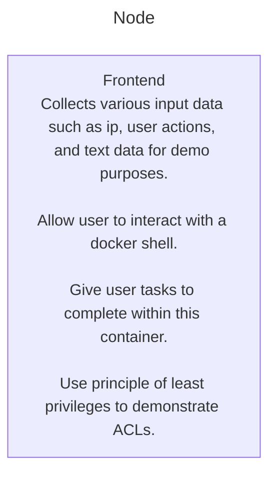

```mermaid
---
title: Node
---
flowchart LR
    Frontend[Frontend
Collects various input data such as ip, user actions, and text data for demo purposes.

Allow user to interact with a docker shell.

Give user tasks to complete within this container.

Use principle of least privileges to demonstrate ACLs.]
```
